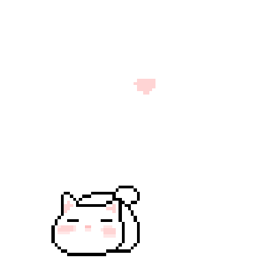

<div align="center">


[](https://git.io/typing-svg)

<p>
  An interactive, responsive birthday experience filled with memories,<br>
  music, confetti, themes and one very special letter.
</p>

<p>
  <a href="https://tamims-birthday.vercel.app/"><strong>🎉 Open the Birthday Surprise</strong></a>
  ·
  <a href="https://github.com/GalibDev/tamims-birthday"><strong>⭐ View Repository</strong></a>
</p>


</div>

---

## ✨ The surprise inside

- 💌 Animated birthday letter with confetti and heart burst
- 🎂 Interactive cake with a blow-sensitive candle, smoke and relight action
- 🖱️ Desktop flame click interaction
- 🎵 Birthday music with an on/off control
- 🖼️ Five-photo memory carousel with personal captions
- 🎨 Pink, purple and blue birthday themes
- 💕 Floating hearts, balloons, stars and an animated mini cake
- 🔁 Replay animation control
- ⌨️ Escape key and outside-tap support for closing popups
- 📱 Carefully designed responsive mobile and desktop layouts

<div align="center">
  
  <br>
  <em>Made to turn a simple birthday wish into a tiny experience.</em>
</div>

## 🎈 How it works

```text
Open the page
     │
     ├── 💌 Read Tamim's letter
     ├── 🖼️ Slide through memories
     ├── 🎂 Blow out the candle
     ├── 🎨 Pick a birthday theme
     └── 🎵 Enjoy the birthday music
```

## 🖼️ Add your own gallery photos

1. Put the new photos inside the [`images`](images) folder.
2. Open [`index.html`](index.html#L144).
3. Replace the five `images/tamim.jpeg` paths in the memory slides:

```html

```

Edit the nearby `<h3>` and `<p>` elements to change each memory title and caption.

## 🎵 Change the birthday music

Replace [`music/birthdaymusic.mp3`](music/birthdaymusic.mp3) with another MP3 using the same filename, or update the audio path in [`index.html`](index.html#L273).

> Browsers may block audible autoplay until the visitor interacts with the page. The site tries immediately and starts the music on the first tap when required.

## 🚀 Run locally

No framework or build step is required. Clone the repository and open `index.html` in a browser, or serve the folder with any static development server.

```bash
git clone https://github.com/GalibDev/tamims-birthday.git
cd tamims-birthday
```

## 📁 Project structure

```text
tamims-birthday/
├── images/              # Photos and decorative assets
├── music/               # Birthday soundtrack
├── index.html           # Page structure and interactions
├── style.css            # Themes, layout and animations
└── README.md            # Project guide
```

---

<div align="center">

### 💖 A birthday wish made especially for Tamim

If this little celebration made you smile, leave a ⭐ on the repository.


</div>
